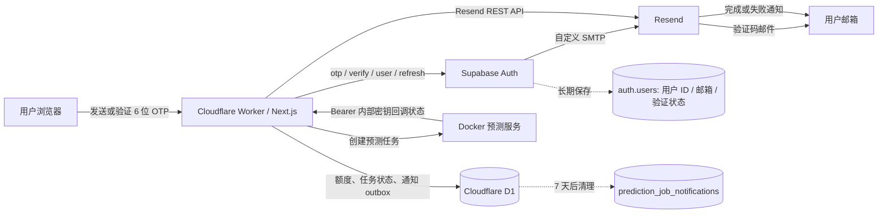
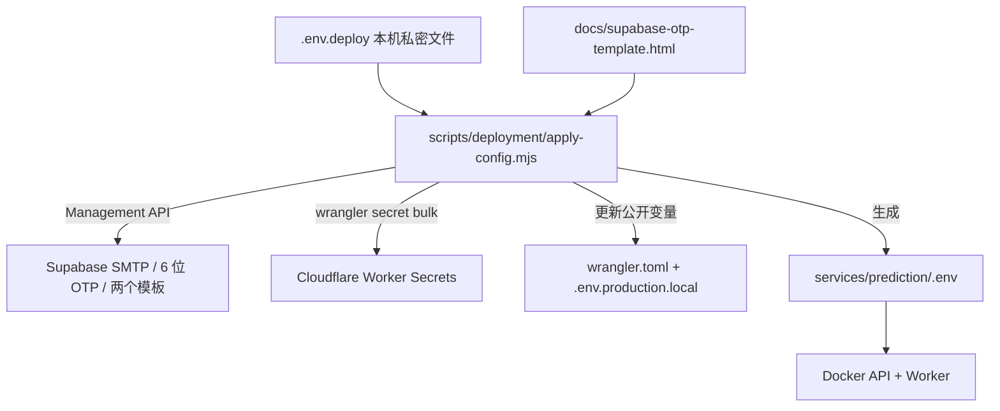
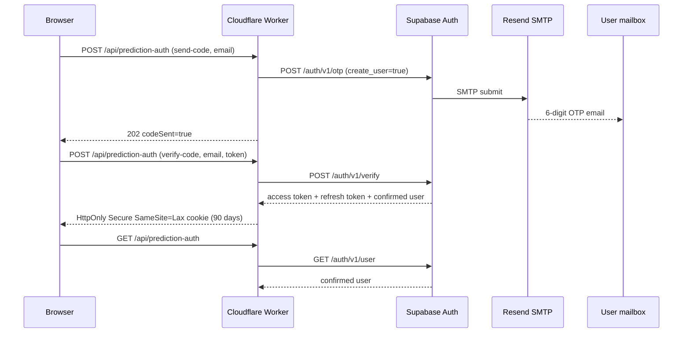
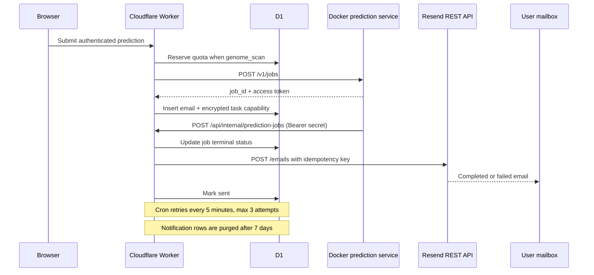

# RAPPTOR 邮箱系统部署与迁移手册

本文档用于两种场景：

1. RAPPTOR 更换域名、Cloudflare Worker 或 Supabase 项目。
2. 新网页复用“邮箱验证码登录 + 长期会话 + 任务完成通知”。

文档只记录变量名、公开地址和配置位置，不包含任何真实 API Key、SMTP
密码、会话令牌或内部服务密钥。

## 0. 邮箱/IP 一键切换

预测访问方式由一个配置控制，功能代码不需要增删：

```dotenv
RAPPTOR_PREDICTION_ACCESS_MODE=email
# 或
RAPPTOR_PREDICTION_ACCESS_MODE=ip
```

| 模式 | 身份与限额 | 邮箱界面与通知 |
| --- | --- | --- |
| `email` | Supabase OTP；每个用户北京时间每天 1 个全基因组扫描 | 显示登录入口；发送完成通知 |
| `ip` | Turnstile＋每日轮换的 IP 哈希；每个 IP 北京时间每天 1 个全基因组扫描 | 登录页重定向；不调用 Supabase、不发送邮件 |

两种模式的短序列任务均不受每日次数限制，但仍保留每分钟 ticket 限流。数据库
不保存原始 IP。配置缺失或拼写错误时安全回退到 `email`，不会意外开放匿名提交。

切换步骤：修改本机 `.env.deploy` 中的值，运行 `npm run deployment:ticket`，再重新
构建并部署 Worker。切到 `email` 时可运行 `npm run deployment:configure`，同时同步
Supabase、Resend、Worker 和 Docker 配置。密钥不需要在两种模式间删除或重新生成。

## 1. 系统边界

邮箱系统代码集中在 `src/features/email-system/`：

| 文件 | 职责 | 是否通用 |
| --- | --- | --- |
| `supabase.ts` | Supabase OTP、用户校验、refresh token 轮换、90 天 Cookie | 是 |
| `http.ts` | 邮箱格式和请求体校验 | 是 |
| `auth-ui.tsx` | 发送验证码、验证登录、登录状态栏 | 是 |
| `auth.module.css` | 登录界面样式 | 是 |
| `resend.ts` | 通过 Resend REST API 发信 | 是 |
| `prediction-notifications.ts` | 预测任务 D1 outbox、重试和通知文案 | RAPPTOR 专用 |

路由和页面是薄适配层：

- `src/app/api/prediction-auth/route.ts`：浏览器与 Supabase Auth 之间的服务端代理。
- `src/app/login/page.tsx`：验证码登录页。
- `src/app/predict/layout.tsx`：公开展示预测页，登录后显示用户状态。
- `src/app/api/predictions/jobs/route.ts`：创建任务时登记通知邮箱。
- `src/app/api/internal/prediction-jobs/route.ts`：接收 Docker 任务状态并触发通知。
- `config/cloudflare-worker.mjs`：每 5 分钟重试通知，每日清理过期数据。

## 2. 总体关系图



平台分工：

- **Supabase** 是用户身份数据库，不负责运行 RAPPTOR 任务。
- **Resend** 是邮件投递平台，不保存 RAPPTOR 登录会话或任务结果。
- **Cloudflare Worker** 执行登录代理、权限校验、额度检查和通知调度。
- **D1** 保存额度和短期通知状态，不作为用户主库。
- **Docker** 只运行预测，不接收邮箱、Supabase Key 或 Resend Key。

### 单一配置源（推荐）

仓库现在用根目录的 `.env.deploy` 作为本机部署配置源。这个文件同时保存域名、
Supabase/Resend/Turnstile 凭据和 Docker 内部密钥，并已被 Git 忽略。GitHub 只保存
不含真实密钥的 `.env.deploy.example`。



首次配置：

```powershell
Copy-Item .env.deploy.example .env.deploy
# 只在本机编辑 .env.deploy，填入空白项
npm run deployment:init    # 自动生成两个内部随机密钥，不输出值
npm run deployment:check
npm run deployment:configure
```

也可以分开执行：

```powershell
npm run deployment:email   # Supabase 邮件设置 + Worker 邮件 Secrets
npm run deployment:ticket  # Worker ticket Secrets + Docker .env + 正式公开变量
```

`deployment:email` 会直接调用 Supabase Management API，所以需要
`SUPABASE_MANAGEMENT_TOKEN`。它是 Supabase 账户的 Personal Access Token（需要
`auth:write`），不是项目的 `service_role` key。脚本不会输出任何密钥值。

## 3. 所需配置清单

### 3.1 必需值

| 变量或凭据 | 从哪里获取 | 填到哪里 | 是否机密 | 用途 |
| --- | --- | --- | --- | --- |
| `SUPABASE_URL` | Supabase 项目 Settings / API Keys 中的 Project URL | Cloudflare Worker Secret | URL 本身不是机密，当前仍按 Secret 管理 | Worker 调用 Supabase Auth |
| `SUPABASE_ANON_KEY` | Supabase 项目 Settings / API Keys 的 anon/publishable key | Cloudflare Worker Secret | 按机密管理 | 调用 Supabase `/auth/v1/*` |
| `SUPABASE_MANAGEMENT_TOKEN` | Supabase Account / Access Tokens | 仅本机 `.env.deploy` | 是 | 由代码同步 SMTP、OTP 和模板，不下发 Worker |
| Supabase SMTP password | Resend API Keys 新建的 sending key | Supabase Authentication / Emails / SMTP Settings | 是 | Supabase 通过 Resend 发 OTP |
| `RESEND_API_KEY` | Resend / API Keys 新建的 sending key | Cloudflare Worker Secret | 是 | Worker 直接发送任务通知 |
| `RESEND_FROM` | 自己决定，地址必须属于 Resend 已验证域名 | Cloudflare Worker 普通变量 | 否 | 任务通知发件人 |
| `RAPPTOR_PREDICTION_SERVICE_SECRET` | 自行生成的高强度随机值 | 本机 `.env.deploy`，脚本同步到 Worker 和 Docker | 是 | ticket 消费与 Docker 状态回调 |

推荐为 Supabase SMTP 和 Worker 任务通知分别创建两个 Resend Key。一个 Key
也能工作，但分开后可以单独撤销、审计和轮换。

绝不能使用 Supabase `service_role` key。当前功能只需要 anon/publishable
key；`service_role` 权限过高，也不能出现在浏览器、Git 或普通部署文档中。

### 3.2 当前公开配置

以下值不是密钥，可以记录：

```text
Supabase project ref: swicrzrhvbkocrssmqpv
Supabase URL: https://swicrzrhvbkocrssmqpv.supabase.co
Resend sender domain: auth.email.duolalab.qzz.io
Recommended sender: RAPPTOR <no-reply@auth.email.duolalab.qzz.io>
Worker URL: https://rapptor.duolalab.qzz.io
Backup Worker URL: https://rapptor.1052596411.workers.dev
D1 binding: RAPPTOR_DB
D1 database: seqedge-catalog
```

更换域名或新建站点时，用新项目的值替换这些公开配置，但不要复制旧 Key。

## 4. Resend 配置

### 4.1 验证发件域名

1. 打开 Resend Dashboard → Domains → Add Domain。
2. 添加专用发信子域，例如 `auth.example.com`。推荐使用子域，不要直接占用主域。
3. Resend 会给出 DKIM、SPF 等 DNS 记录。
4. 到域名 DNS 服务商（当前是 Cloudflare DNS）逐条添加，记录名和值以 Resend
   当时显示的内容为准。
5. 返回 Resend 点击 Verify，直到域名状态为 Verified。
6. 建议同时配置 DMARC；它不是程序 Key，但会影响邮件可信度和到达率。

域名迁移时必须先验证新发件域，再更换发件地址。未验证的 From 地址会被
Resend 拒绝。

### 4.2 创建 API Key

位置：Resend Dashboard → API Keys → Create API Key。

推荐创建：

- `rapptor-supabase-smtp`：只给 Supabase SMTP 使用。
- `rapptor-worker-notifications`：只给 Cloudflare Worker 使用。

Key 只在创建时完整显示一次。立即填入被 Git 忽略的 `.env.deploy`，不要写入受
版本控制的环境文件、截图、聊天或 Git。权限选择 Sending access，并尽量限制到
已验证域名。

### 4.3 Resend 在两条邮件链路中的区别

- OTP：Supabase 以 SMTP 客户端身份连接 Resend，Key 填在 Supabase SMTP
  password 中。
- 任务通知：Worker 调用 `https://api.resend.com/emails`，Key 存在
  `RESEND_API_KEY` Secret 中。

## 5. Supabase 配置

### 5.1 创建项目并取得 URL 和 anon key

1. 创建 Supabase 项目。
2. 打开 Project Settings → API Keys。
3. 复制 Project URL，作为 `SUPABASE_URL`。
4. 复制 anon/publishable key，作为 `SUPABASE_ANON_KEY`。
5. 不要复制或使用 `service_role` key。

不同版本 Dashboard 的入口名称可能显示为 Settings → API Keys 或顶部
Connect 面板；判断标准是值属于当前 project ref。

### 5.2 邮箱登录参数

位置：Authentication → Sign In / Providers → Email。

```text
Enable email provider: On
Allow new users to sign up: On
Confirm email: On
Email OTP expiration: 3600 seconds
Email OTP length: 6 digits
```

网页输入框只接受 6 位数字，所以 Supabase OTP length 必须保持为 6。若设为
8，邮件虽能到达，但网页会拒绝验证码。

### 5.3 自定义 SMTP

默认使用 `npm run deployment:email` 由代码同步；Dashboard 的等价位置是
Authentication → Emails → SMTP Settings。

| 字段 | 填写内容 |
| --- | --- |
| Sender name | `RAPPTOR` |
| Sender email | 已验证域名下的地址，例如 `no-reply@auth.example.com` |
| Host | `smtp.resend.com` |
| Port | `465`；若环境要求 STARTTLS 可用 `587` |
| Username | `resend` |
| Password | Resend 为 Supabase SMTP 创建的 API Key |

SMTP password 只填在 Supabase，Cloudflare 不需要知道这一份 Key。

### 5.4 两个 OTP 模板都必须配置

默认使用 `npm run deployment:email` 把 `docs/supabase-otp-template.html` 同时同步到
两个模板；Dashboard 的等价位置是 Authentication → Emails → Templates。

必须同时修改：

1. **Confirm sign up**：新邮箱第一次请求验证码时使用。
2. **Magic link or OTP**：已有用户再次登录时使用。

Subject：

```text
Your RAPPTOR verification code
```

Body 使用仓库中的 `docs/supabase-otp-template.html`。两个模板都必须保留：

```text
{{ .Token }}
```

只修改 Magic link 模板会导致新用户收到 “Confirm email address” 链接，而不是
验证码。模板是 Supabase 平台配置，修改后立即生效，不需要重新部署 Worker。

## 6. Cloudflare 配置

### 6.1 代码同步（推荐）

`.env.deploy` 填完后执行：

```powershell
npm run deployment:email
```

脚本通过 `wrangler secret bulk` 更新 `SUPABASE_URL`、`SUPABASE_ANON_KEY`、
`RESEND_API_KEY` 和 `RESEND_FROM`。更换发件域名时，只需修改
`EMAIL_FROM_ADDRESS`、`RAPPTOR_PUBLIC_SITE_URL` 并重新运行。

### 6.2 Dashboard 手工填写（备用）

Workers & Pages → `rapptor` → Settings → Variables and Secrets。

添加 Secret：

```text
SUPABASE_URL
SUPABASE_ANON_KEY
RESEND_API_KEY
RAPPTOR_PREDICTION_SERVICE_SECRET
```

可选普通变量：

```text
RESEND_FROM=RAPPTOR <no-reply@auth.example.com>
```

Dashboard 保存 Secret 会创建一个新的 Worker 配置版本，但代码有变化时仍要执行
正式部署。

### 6.3 Wrangler 单项填写（备用）

在 RAPPTOR 目录运行：

```powershell
npx wrangler secret put SUPABASE_URL
npx wrangler secret put SUPABASE_ANON_KEY
npx wrangler secret put RESEND_API_KEY
npx wrangler secret put RAPPTOR_PREDICTION_SERVICE_SECRET
```

命令会在终端中单独提示输入 Secret value。不要把真实值直接写进命令参数。

只查看已配置的名称，不读取值：

```powershell
npx wrangler secret list
```

使用本机代理时：

```powershell
$env:HTTP_PROXY = 'http://127.0.0.1:7997'
$env:HTTPS_PROXY = 'http://127.0.0.1:7997'
npx wrangler secret list
```

## 7. D1 数据库

### 7.1 用户主记录不在 D1

Supabase `auth.users` 长期保存：

- Supabase user ID。
- 规范化后的邮箱地址。
- 邮箱确认时间等认证元数据。

RAPPTOR 不保存密码。第一次请求 OTP 时 Supabase 可以创建未确认用户；验证码
成功后，用户变为已确认状态。

### 7.2 D1 只保存业务状态

`0011_prediction_daily_quota.sql` 创建：

- `prediction_daily_quota`：按 Supabase user ID 和北京时间日期记录一次
  whole-genome scan；不保存邮箱。

`0012_prediction_job_notifications.sql` 创建：

- `prediction_job_notifications`：保存 job ID、user ID、通知邮箱、任务类型、
  投递状态、尝试次数和错误摘要。
- 不保存 DNA 序列、结果文件或 Supabase token。
- 行保留 7 天，随后由 Cron 清理。

`0013_prediction_notification_links.sql` 增加加密的临时任务 capability 和参考序列名。
任务 access token 使用由 `RAPPTOR_PREDICTION_SERVICE_SECRET` 派生的 AES-GCM
密钥加密后才写入 D1；明文只进入邮件 URL 的 `#fragment`，不会随 HTTP 请求或
Referer 发送到服务器。任何获得完整链接的人都能在结果过期前查看，因此该链接应
按临时私密分享链接处理。

应用 migration：

```powershell
npx wrangler d1 migrations apply RAPPTOR_DB --remote
```

## 8. OTP 登录时序



会话 Cookie 在同一浏览器保留 90 天。访问预测页期间，过期 access token 会通过
Supabase refresh token 轮换；退出登录会清 Cookie 并调用 Supabase logout。

## 9. 任务完成通知时序



Resend 幂等键为 `prediction-completed/<job_id>`。邮件发送失败不会取消已经排队的
预测任务。完成通知同时发送品牌 HTML 和纯文本备用正文；成功按钮携带临时 capability，
打开后直接恢复任务、建立 artifact Cookie 并加载基因组浏览器。

## 10. Docker 需要的最小接口

Docker 不直接调用 Supabase 或 Resend，也不需要这些 Key。与邮件有关的唯一动作是
在任务状态变化时回调 Worker：

```http
POST /api/internal/prediction-jobs
Authorization: Bearer <RAPPTOR_PREDICTION_SERVICE_SECRET>
Content-Type: application/json
```

Worker 验证内部密钥、写入 D1，并在终态触发邮件。Docker 不应在回调中发送邮箱。

## 11. 可选验收测试配置

`/api/internal/email-test` 仅用于一次性检查 Resend REST 投递：

```text
RESEND_TEST_TO
RAPPTOR_EMAIL_TEST_TOKEN
```

两者都应作为 Worker Secret。验收完成后删除
`RAPPTOR_EMAIL_TEST_TOKEN`，使测试路由不可再调用。正式任务通知不依赖
`RESEND_TEST_TO`。

## 12. 新站点快速接入

### 12.1 只需要邮箱 OTP 登录

复制：

```text
src/features/email-system/http.ts
src/features/email-system/supabase.ts
src/features/email-system/auth-ui.tsx
src/features/email-system/auth.module.css
src/app/api/prediction-auth/route.ts  （按新站点改名即可）
src/app/login/page.tsx
docs/supabase-otp-template.html
```

配置 `SUPABASE_URL`、`SUPABASE_ANON_KEY`、Supabase SMTP 和两个模板即可。
`prediction-notifications.ts`、D1 和 Docker 都不是纯登录功能的必需项。

### 12.2 还需要后台任务通知

额外复制或实现：

```text
src/features/email-system/resend.ts
src/features/email-system/prediction-notifications.ts
database/migrations/0012_prediction_job_notifications.sql
database/migrations/0013_prediction_notification_links.sql
Worker scheduled handler
任务创建登记点
任务终态回调点
```

新业务可以保留 `resend.ts`，把 `prediction-notifications.ts` 替换为自己的 outbox
适配器。不要把用户邮箱传给计算容器；只让 Web/Worker 层管理通知。

### 12.3 最短部署顺序

1. 在 Resend 验证新发件域名。
2. 创建两份 Resend sending key。
3. 创建 Supabase 项目，记录 Project URL 和 anon key。
4. 在 Supabase 配置 Email provider、6 位 OTP、SMTP 和两个邮件模板。
5. 创建或绑定 D1，并应用需要的 migrations。
6. 在 Cloudflare 写入 Secrets 和 `RESEND_FROM`。
7. 运行 `npm run deployment:ticket`，让 Worker 的
   `RAPPTOR_PREDICTION_SERVICE_SECRET` 与 Docker 的
   `RAPPTOR_TICKET_SERVICE_SECRET`、`RAPPTOR_JOB_CALLBACK_SECRET` 使用同一个值。
8. 执行 `npm run verify`。
9. 执行 `npm run deploy:cf`。
10. 完成下面的验收清单。

## 13. 验收清单

- 未登录用户可以浏览预测界面，但提交 API 返回 `AUTH_REQUIRED`。
- 新邮箱收到品牌化 6 位 OTP，而不是确认链接。
- 已有邮箱再次登录也收到相同模板。
- 验证成功后刷新和重开浏览器仍保持登录。
- 退出后预测提交被拒绝。
- 短序列预测不受每日次数限制。
- 同一用户北京时间每天只能提交一次 whole-genome scan。
- 真实任务成功或失败后只收到一封通知。
- 重放终态回调不会重复发信。
- D1 不含序列、结果、密码或 Supabase token；临时任务 capability 仅以 AES-GCM
  密文保存。
- Docker 环境中不存在 Supabase 和 Resend Key。

## 14. 常见故障

| 现象 | 最可能原因 | 检查位置 |
| --- | --- | --- |
| 收到确认链接而不是验证码 | 只改了 Magic link，未改 Confirm sign up | Supabase Emails / Templates |
| 邮件是 8 位码，网页只接收 6 位 | Email OTP length 配置错误 | Supabase Providers / Email |
| OTP 完全收不到 | SMTP Key、域名验证、垃圾箱或 Resend 投递失败 | Supabase SMTP、Resend Logs |
| Worker 返回 `AUTH_UNAVAILABLE` | Supabase URL 或 anon key 缺失 | Cloudflare Secrets |
| 每次都要重新登录 | Cookie 被清理、跨域、Supabase session 被撤销 | 浏览器 Cookie、Supabase Auth logs |
| 完成通知没有发送 | D1 outbox 未登记、回调未到或 Resend Key 失效 | Worker Logs、D1、Resend Logs |
| 通知重复 | 未使用稳定幂等键 | Resend 请求的 Idempotency-Key |

## 15. 密钥轮换

### Resend

1. 先创建新 Key。
2. 更新 Supabase SMTP password 或 Cloudflare `RESEND_API_KEY`。
3. 分别测试 OTP 和任务通知。
4. 确认成功后撤销旧 Key。

### Supabase anon key

1. 在 Supabase 生成或取得新 anon/publishable key。
2. 更新 Cloudflare `SUPABASE_ANON_KEY`。
3. 测试 OTP、会话刷新和受保护提交。
4. 再撤销旧 Key。

### Docker 回调密钥

Worker 与 Docker 必须使用同一值。先规划短暂停机或双密钥兼容窗口，再轮换；
否则回调会暂时返回 401，任务状态和邮件会延迟。该值同时用于加密 D1 中待发送
通知的临时 capability；轮换前应先发送或清理 pending outbox，否则旧密文无法解密。

## 16. 安全规则

- `.env.deploy`、`.env.local`、API Key、SMTP password、OTP、Cookie 和回调密钥不得提交 Git。
- 不在日志中记录邮箱正文、验证码、access token、refresh token 或序列。
- 邮件不得包含序列或结果文件。完整结果链接本身是临时访问凭据，只能放在
  `#fragment` 中，并应在正文中提示“持链接可访问”。
- Webhook/内部回调必须校验 Bearer secret。
- Cloudflare 只保存运行时 Secret；仓库只保存变量名和模板。
- 离职、泄露或域名迁移时立即轮换对应 Key。

## 17. 2026-09-06 ticket 启用记录

- Worker 主域名：`https://rapptor.duolalab.qzz.io`，备份域名：`https://rapptor.1052596411.workers.dev`。
- Turnstile 同一 widget 同时允许这两个 hostname。
- Docker API/worker 使用容器级 `1.1.1.1`、`8.8.8.8` DNS，避免宿主机校园 DNS 对新自定义域名的负缓存。
- 已完成线上验收：无 ticket 返回 401，无效 ticket 返回 401，有效 ticket 返回 202，同一 ticket 重放返回 401。
