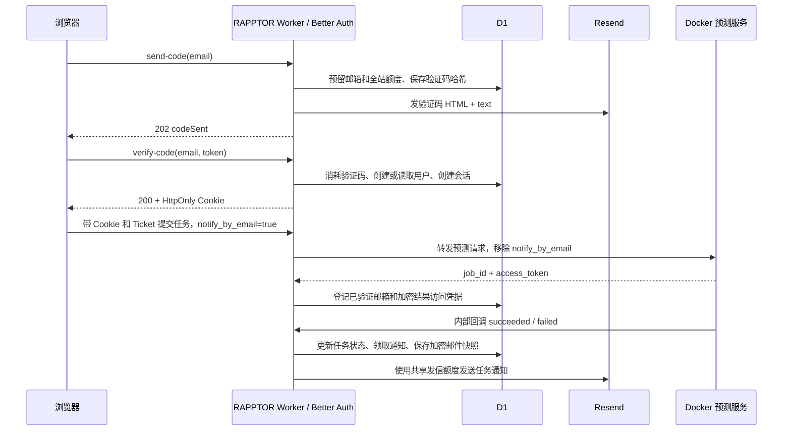

# RAPPTOR 新邮件系统：分阶段部署与接口对接

更新日期：2026-09-30。本文描述当前正式代码；旧 Supabase 说明仅用于历史参考和回退。

## 阶段 0：确认架构和边界

当前方案是 **Cloudflare Worker 内的 Better Auth + D1 + Resend**。Better Auth 是应用依赖，
认证逻辑运行在 RAPPTOR Worker 中；Resend 负责发信，D1 保存用户、验证码哈希、会话和额度。

生产站点：`https://rapptor.xulab.science`。

| 组件 | 职责 | 代码入口 |
| --- | --- | --- |
| 登录接口 | 发码、验码、读取会话、登出 | `src/app/api/prediction-auth/route.ts` |
| Better Auth | 用户身份、一次性验证码、Cookie 会话 | `src/features/email-system/better-auth.ts` |
| 认证表结构 | Drizzle 与 D1 字段映射 | `src/features/email-system/better-auth-schema.ts` |
| 发信与额度 | Resend 请求、共享日额度、邮箱冷却 | `resend.ts`、`otp-rate-limit.ts` |
| 验证码模板 | HTML 和纯文本内容 | `verification-email.ts` |
| 任务通知 | 登记收件人、加密邮件快照、领取与重试 | `prediction-notifications.ts` |
| 后台重试 | 每 5 分钟扫描待发送通知 | `config/cloudflare-worker.mjs` |
| 旧认证 | 保留供回退，正式路由不调用 | `supabase.ts`、`supabase-route.ts` |

表中的短文件名均位于 `src/features/email-system/`。



Docker 不需要 Better Auth、Resend 或 D1 凭据，也不需要用户邮箱。当前登录接口使用
Cookie，不向浏览器返回 Supabase access token，也不提供公开的 `/api/auth/*` 路由。

## 阶段 1：准备数据库与环境变量

### 1.1 数据库迁移

现有 RAPPTOR 基础表迁移应已完成。新增认证需要 `0018_better_auth.sql`；共享发信额度
和加密完整邮件快照需要 `0019_auth_email_reliability.sql`。后者依赖 `0012`、`0013`
创建的通知表和结果凭据字段。

| 表 | 保存内容 |
| --- | --- |
| `user` | 稳定用户 ID、邮箱、邮箱验证状态 |
| `session` | 会话 token、到期时间、用户关联、IP 和 User-Agent 元数据 |
| `account` | Better Auth 账户模型；当前邮箱验证码登录不要求密码 |
| `verification` | 验证码哈希、到期时间、尝试次数 |
| `rate_limit` | Better Auth 按 IP / 接口的限流记录 |
| `auth_email_limits` | 邮箱 HMAC 限流键和全站共享发信日额度 |
| `prediction_job_notifications` | 临时通知、加密 capability、加密完整邮件快照 |

现网已应用 `0018`、`0019`。迁移其他环境时先检查迁移记录和实际表结构，**只执行尚未
应用的迁移**；`0019` 含 `ALTER TABLE ADD COLUMN`，不能重复执行。

下面是已有基础表、尚未应用新增迁移时的命令，工作目录为 `RAPPTOR/`：

```bash
npx wrangler d1 execute seqedge-catalog --remote --file database/migrations/0018_better_auth.sql --yes
npx wrangler d1 execute seqedge-catalog --remote --file database/migrations/0019_auth_email_reliability.sql --yes
```

迁移旧用户时将原用户 ID、邮箱和验证状态导入 `user`，避免历史预测额度关联中断。
不要把用户导出或导入 SQL 提交到 Git；旧 Supabase 会话不能沿用，用户需要重新登录。

### 1.2 配置表

| 配置 | 类型 | 用途 / 当前值 |
| --- | --- | --- |
| `RAPPTOR_DB` | D1 binding | 用户、会话、额度、通知；现网 `seqedge-catalog` |
| `BETTER_AUTH_SECRET` | Worker Secret | 至少 32 字符的独立随机认证密钥 |
| `RESEND_API_KEY` | Worker Secret | 已验证发件域名的发送权限 Key |
| `RESEND_FROM` | 普通变量 | `RAPPTOR <no-reply@auth.xulab.science>` |
| `RAPPTOR_PUBLIC_SITE_URL` | 普通变量 | `https://rapptor.xulab.science`，用于 Origin 和邮件链接 |
| `RAPPTOR_PREDICTION_ACCESS_MODE` | 普通变量 | `email` 为正式邮箱登录；`ip` 关闭邮箱登录与通知 |
| `RAPPTOR_EMAILS_PER_DAY` | 普通变量 | `100`，验证码、任务通知、内部发信测试共用；代码上限 100 |
| `RAPPTOR_AUTH_EMAILS_PER_ADDRESS_PER_DAY` | 普通变量 | `10`，每个邮箱每天最多 10 次发码预留 |
| `RAPPTOR_PREDICTION_BASES_PER_DAY` | 普通变量 | `12000000`，每用户每日输入碱基数 |
| `RAPPTOR_PREDICTION_SERVICE_SECRET` | Worker / Docker Secret | 内部回调认证，同时用于加密通知内容和结果凭据 |
| `RAPPTOR_TURNSTILE_SECRET` | Worker Secret | 预测提交的人机校验；不代替邮箱验证码 |
| `NEXT_PUBLIC_RAPPTOR_TURNSTILE_SITE_KEY` | 公开变量 | 浏览器 Turnstile widget |

交互式设置 Secret，不把真实值写入命令参数、文档或 Git：

```bash
npx wrangler secret put BETTER_AUTH_SECRET
npx wrangler secret put RESEND_API_KEY
npx wrangler secret put RAPPTOR_PREDICTION_SERVICE_SECRET
```

会话校验和登出只依赖认证密钥与 D1；发码额外需要 Resend 配置。`wrangler.toml` 保存
正式域名和普通变量，避免 CLI 部署覆盖控制台设置。`.env.local.example`、
`.env.deploy.example` 仅含占位配置；旧 `deployment:email` / `deployment:configure`
会配置 Supabase，当前 Better Auth 部署不要使用它们。

### 1.3 邮件与重置时间

- 验证码：6 位数字、10 分钟有效、最多 3 次错误尝试；成功验证后不可再次使用。
- 重新发码：同邮箱至少间隔 60 秒；成功生成新码后使用最新邮件中的验证码。
- Better Auth 另有按 IP 的接口限流；达到限制时返回 429。
- 邮箱日额度、全站发信日额度和预测日额度均在 **UTC 00:00 / 北京时间 08:00** 重置。
- 全站最多 100 次发信尝试；失败、超时结果不明和通知重试也计数，属于保守预算。
  已用完共享额度的请求在生成新验证码前被拒绝，避免破坏用户仍有效的旧码。
- Resend Free 另有每月 3,000 封的账户额度；同工作区其他应用和入站邮件也占用
  提供商额度。本地日预算不是 Resend 账户实时剩余额度查询。
- 发件域名需要在 Resend 验证 SPF / DKIM，维护 DMARC。DNS 验证通过不保证进入
  收件箱；模板同时提供 HTML 与纯文本，用户仍可能需要将邮件标为非垃圾邮件。

官方额度：[Resend sending limits](https://resend.com/docs/knowledge-base/resend-sending-limits)。

## 阶段 2：对接邮箱登录接口

### 2.1 通用规则

所有登录操作使用同一个同源接口：`/api/prediction-auth`。POST 请求使用
`Content-Type: application/json`；响应使用 `Cache-Control: no-store`。
浏览器发送时 Origin 必须与站点配置匹配，Cookie 由浏览器保存和携带。

当前没有跨域 CORS 登录协议。若新前端部署到另一域名，需要另行设计可信 Origin、
CORS 和 Cookie 策略；不能只把请求 URL 换成 RAPPTOR 域名。

| 方法 | 请求 | 成功结果 |
| --- | --- | --- |
| GET | 无 body，携带会话 Cookie | 200，当前用户与可用的预测额度 |
| POST | `{"action":"send-code","email":"person@example.com"}` | 202，发码已提交 |
| POST | `{"action":"verify-code","email":"person@example.com","token":"123456"}` | 200，已认证 + `Set-Cookie` |
| POST | `{"action":"logout"}` | 200，撤销会话 + 清除 Cookie |

邮箱和 `123456` 为文档示例，不是真实验证码。首次成功验证会自动创建用户。

发码成功响应：

```json
{
  "authenticated": false,
  "codeSent": true,
  "retryAfter": 60,
  "expiresIn": 600
}
```

`retryAfter` 是下次允许发码的等待秒数；`expiresIn` 才是验证码有效秒数。
202 表示发信接口接受请求，不代表邮件已到收件箱。

验码或 GET 会话成功响应示例：

```json
{
  "authenticated": true,
  "user": { "id": "stable-user-id", "email": "person@example.com", "emailConfirmed": true },
  "quota": { "usedBases": 0, "totalBases": 12000000, "resetAt": "2026-10-01T00:00:00.000Z" }
}
```

额度读取失败时 `quota` 可以省略；前端不能因此认定用户未登录。已携带同邮箱有效
会话的验码重试会直接返回已认证，用于处理重复提交或跳转重试，不会再次使用已消耗的码。

### 2.2 最小浏览器接入

```js
async function authAction(action, fields = {}) {
  const response = await fetch('/api/prediction-auth', {
    method: 'POST',
    credentials: 'same-origin',
    cache: 'no-store',
    headers: { 'Content-Type': 'application/json' },
    body: JSON.stringify({ action, ...fields }),
  });
  const payload = await response.json();
  if (!response.ok) {
    throw Object.assign(new Error(payload.error?.message || 'Authentication failed'), {
      status: response.status,
      code: payload.error?.code,
      retryAfter: response.headers.get('Retry-After'),
    });
  }
  return payload;
}

// 分别绑定在发码、验码、登出按钮上；不要在加载页面时自动发码。
// await authAction('send-code', { email });
// await authAction('verify-code', { email, token: codeFromUser });
// await authAction('logout');
```

页面初始化和登录后定期读取会话：

```js
const response = await fetch('/api/prediction-auth', {
  credentials: 'same-origin', cache: 'no-store',
});
const session = await response.json();
// 200: 展示 session.user 和可选 session.quota。
// 401: 展示登录入口；503: 显示服务暂不可用，不伪装成已登出。
```

### 2.3 错误合同

登录接口错误统一形状：

```json
{ "authenticated": false, "error": { "code": "INVALID_CODE", "message": "Human-readable message" } }
```

| HTTP | `error.code` | 前端处理 |
| --- | --- | --- |
| 400 | `INVALID_AUTH_REQUEST` | 检查 action、邮箱和 6 位数字验证码 |
| 401 | `AUTH_REQUIRED` | 会话不存在或到期，进入登录页 |
| 401 | `INVALID_CODE` | 可能错误、已使用或被新码替换；提示使用最新邮件 |
| 401 | `CODE_EXPIRED` | 请求新码 |
| 401 | `CODE_ATTEMPTS_EXCEEDED` | 当前码尝试次数耗尽，请求新码 |
| 403 | `AUTH_ORIGIN_REJECTED` | 检查域名、Origin 和站点配置 |
| 404 | `AUTH_DISABLED` | 当前为 IP 模式，不显示邮箱登录 |
| 429 | `AUTH_RATE_LIMITED` | 展示服务端 message，并按可用的 `Retry-After` 等待 |
| 502 | `AUTH_PROVIDER_ERROR` | 验证结果异常，保留现场并联系维护者 |
| 503 | `OTP_SEND_FAILED` | 发信失败，等待后重发，不反复自动请求 |
| 503 | `AUTH_UNAVAILABLE` | D1、认证或发信配置暂不可用；不要当作验证码错误 |

发码限流响应带标准 `Retry-After` 秒数；验码限流目前不保证该 header，前端可使用
错误消息中的一分钟等待作为回退。错误文案可能改动，逻辑应匹配 HTTP 状态和 code。

## 阶段 3：会话和受保护接口

- 生产登录使用 Better Auth 的 `__Secure-better-auth.session_token` Cookie，具备
  HttpOnly、Secure、SameSite=Lax、Path=/；开发环境的名称或 Secure 属性可能不同。
- 会话默认 7 天；活跃会话每超过 24 小时可续期。GET 登录状态接口会将新的
  `Set-Cookie` 返回浏览器，现有页面每 45 分钟及任务提交后刷新一次状态。
- `currentPredictionUser(request)` 用于只读授权，不执行丢失 Cookie 的续期。
  需要续期时传入响应 Headers，并将其返回浏览器。
- `requirePredictionAuth(request)` 返回已确认邮箱的用户，或 401 / 503 Response。
- 不把验证码、Cookie token 或 Resend Key 放入 localStorage，不使用 Supabase JWT
  作为新接口的认证方式。服务端代理若调用这些接口，要正确转发 Cookie 与所有 Set-Cookie。
- 只有登出请求成功且返回 `authenticated:false` 才更新为已退出；请求失败时保留
  状态并提示重试，防止共享设备上误认为已经退出。
- 用户 ID 是额度和任务记录的稳定关联键；邮箱不是任务授权凭据。结果链接另外使用
  创建任务时返回的临时 capability，持有链接的人可在结果有效期内访问。

没有新增公开的用户列表、删除用户或管理员管理 API；若需要管理用户，应单独设计
管理员认证、权限检查和审计，不能直接把 D1 或 Better Auth 内部接口暴露给浏览器。

## 阶段 4：接入任务完成通知

先通过现有 `POST /api/prediction-tickets` 获取预测 Ticket（仍需 Turnstile），再提交
已符合预测服务合同的 payload，仅增加 `notify_by_email: true`：

```js
const response = await fetch('/api/predictions/jobs', {
  method: 'POST', credentials: 'same-origin',
  headers: { 'Content-Type': 'application/json', Authorization: `Ticket ${ticket}` },
  body: JSON.stringify({ ...existingPredictionPayload, notify_by_email: true }),
});
const created = await response.json();
// 任务接受时返回上游 job_id / access_token 等字段，通常是 202。
```

| 对接项 | 合同 |
| --- | --- |
| 任务路径 | `POST /api/predictions/jobs`，不是旧 `/api/predictions` 创建路径 |
| `notify_by_email` | 可选 boolean，省略或 false 不登记通知；其他类型返回 400 |
| 收件人 | 服务端读取当前已验证用户的邮箱，客户端不指定任意通知收件人 |
| 模式 | 支持真实 `predict`、`genome_scan`；IP 模式不发送邮件 |
| 向 Docker 转发 | Worker 移除 `notify_by_email`，Docker 不需增加邮件逻辑 |
| 返回值 | 任务响应不会等待任务完成或通知发出；登记通知失败不丢弃已接受任务的凭据 |

Ticket 和预测字段详见 [预测服务说明](prediction-service.md) 与
[现有在线接入说明](prediction-live-acceptance.md)。必须沿用实际已支持的预测字段，
不能将上面的 `existingPredictionPayload` 当成新的固定接口模型。

## 阶段 5：Docker 回调与通知重试

内部接口：`POST /api/internal/prediction-jobs`。请求来自服务器，不能从浏览器调用。

```http
Authorization: Bearer <RAPPTOR_PREDICTION_SERVICE_SECRET>
Content-Type: application/json
```

结束事件示例（ID、哈希和日期仅为示例）：

```json
{
  "jobId": "0123456789abcdef0123456789abcdef",
  "status": "succeeded",
  "mode": "predict",
  "modelVersion": "candidate-github-93cf",
  "inputBases": 100,
  "inputSha256": "aaaaaaaaaaaaaaaaaaaaaaaaaaaaaaaaaaaaaaaaaaaaaaaaaaaaaaaaaaaaaaaa",
  "submittedAt": "2026-10-01T01:00:00.000Z",
  "startedAt": "2026-10-01T01:00:05.000Z",
  "endedAt": "2026-10-01T01:01:00.000Z",
  "artifactsExpiresAt": "2026-10-02T01:01:00.000Z"
}
```

`jobId` 必须是 32 位小写十六进制；`inputSha256` 为 64 位十六进制；`inputBases`
为正安全整数。必要字段见 `PredictionJobEvent`，可选字段包括 `error`、`artifacts`、
checkpoint / model config 哈希。事件正文最多 80 KiB；artifact manifest 最多 64 KiB。

| HTTP | 响应 / 含义 |
| --- | --- |
| 200 | `{"accepted":true}`，任务事件已接受，不等于邮件已投递 |
| 400 | `{"accepted":false}`，事件格式无效 |
| 401 | 内部 Bearer secret 无效 |
| 409 | 任务身份字段冲突或状态回退；检查回调顺序与任务模型 |
| 413 | 正文过大 |
| 503 | 数据库或服务配置暂不可用，可稍后重试 |

状态按 `queued → running → succeeded/failed` 前进，终态不回退。
相同终态回调可再次尝试通知；D1 原子领取和 Resend 幂等键防止重复投递。

通知处理规则：

1. Worker 收到终态回调后在响应结束任务中尝试发送，Cron 每 5 分钟补偿重试。
2. 原子领取通知；首次发送前将发件人、收件人、正文、HTML 和结果 URL 整体加密保存。
3. 重试沿用完整快照及 `prediction-completed/<jobId>` 幂等键，配置或模板更新不改变它。
4. 普通发送最多 3 次，相邻尝试至少 5 分钟；首次尝试后重试窗口为 23 小时，避免超过
   Resend 幂等键 24 小时保留期。共享日预算阻断、额度数据库不可用时不消耗发送重试次数。
5. 通知表在创建后保留 7 天。**结果文件有效期独立**，由服务的 artifacts 到期时间决定；
   通知保留 7 天不表示结果一定可访问 7 天。
6. 邮件 URL 使用 `#access=...` fragment 携带私密 capability，并提示持链接者可访问。
   邮件不含序列或结果文件；不要在日志、工单或公开 issue 中粘贴完整链接。

`sent` 表示 Resend 接受了邮件请求，不等于到达收件箱。实际投递、退信和垃圾邮件
需要在 Resend 日志 / Metrics 中排查；当前代码没有新增 Resend webhook 回调接口。

## 阶段 6：部署、检查和交接

顺序：检查 D1 迁移 → 配置 Secret / 普通变量 → 构建 → 部署 → 由维护者做实际验收。

```bash
npm ci
npm run typecheck
npm run lint
node scripts/cloudflare/run-opennext-build.mjs
npx opennextjs-cloudflare deploy
```

Cloudflare 工具链需 Node.js 22+。上述命令不会主动发送测试邮件。
自动化检查文件位于 `tests/api/better-auth-d1.test.ts` 和相关通知 / 预测接口测试；
旧认证测试保留用于回退检查。2026-09-30 这轮发布已通过类型、相关 ESLint 和 Cloudflare
构建检查，**本轮未运行自动化测试，也未发真实验收邮件**，不能将此记录当作完整验收。

维护者实际验收建议：发码与重发冷却、最新码登录、过期 / 错误码、Cookie 续期、登出失败
重试、08:00 重置、勾选通知后正常完成与失败回调、额度耗尽后的后台等待。
真实邮件验收需要使用获授权的邮箱，不能用文档中的示例邮箱发送。

可选维护接口 `POST /api/internal/email-test` 使用独立 `RAPPTOR_EMAIL_TEST_TOKEN`，
只发送到配置的 `RESEND_TEST_TO`，同样占用全站额度；正常业务不需要启用它。

## 阶段 7：保留旧功能和后续改动

- `supabase.ts`、`supabase-route.ts` 和原模板保留，正式路径不调用。没有现成的运行时
  Better Auth / Supabase 切换开关；`email/ip` 是访问模式，不是认证提供商切换。
- 若回退 Supabase，需要恢复路由和受保护接口的认证引用、对应配置与会话方案；用户
  需要重新登录。不要删除 D1 用户或用不同 ID 覆盖旧用户，否则会影响历史额度关联。
- 修改验证码样式：编辑 `verification-email.ts` 后构建和部署。旧邮件不会改变。
- 修改通知样式：编辑 `prediction-notifications.ts`；已保存快照的通知继续使用旧内容。
- 轮换认证 Secret 会使旧 Cookie 不再有效。轮换预测服务 Secret 前要处理待发送通知，
  因为旧 capability 和邮件快照用该密钥加密，Worker 与 Docker 也必须同步更新。
- `.env*` 实际文件、用户导出 SQL、部署 token、运行时截图和构建目录保持 Git 忽略。
  新接口对接问题请记录 endpoint、HTTP 状态、错误 code、时间和任务 ID，避免记录秘密。

历史部署过程与 Supabase 回退说明：[email-system-deployment.zh-CN.md](email-system-deployment.zh-CN.md)。
